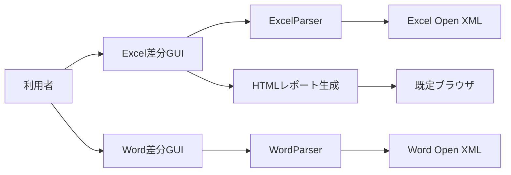

# 現行実装基本設計書

| 項目       | 内容                                          |
| :--------- | :-------------------------------------------- |
| 管理ID     | IMPL-BD-001                                   |
| 対象       | Excel差分GUI、Word差分GUI、Excel HTMLレポート |
| 実装言語   | Python 3.10以上                               |
| 実行時依存 | Python標準ライブラリ、Tkinter                 |

## 1. 目的と対象範囲

Office Open XML形式の2ファイルを読み取り、Excelはシート・セル・数式、Wordは本文段落テキストの差分を可視化する。入力ファイルを更新しない読み取り専用のプロトタイプであり、Excel用とWord用の統合入口は存在しない。

## 2. 構成と責務

| 構成要素              | 責務                                                       |
| :-------------------- | :--------------------------------------------------------- |
| `prot/excel_diff.py`  | Excelファイル解析、シート・セル比較、GUI表示、レポート起動 |
| `prot/html_report.py` | Excel差分をタイムスタンプ付きHTMLへ出力                    |
| `prot/word_diff.py`   | Word段落抽出、段落差分、左右比較GUIと差分移動              |

## 3. 実行前提と境界

- それぞれ `python prot/excel_diff.py`、`python prot/word_diff.py` で直接起動する。
- Excelは `.xlsx` / `.xlsm`、Wordは `.docx` / `.docm` を受け付ける。
- 解析対象はZIP内XMLであり、Officeアプリケーションを自動操作しない。
- 比較結果はメモリ上で保持する。ExcelだけがHTML成果物を出力し、比較履歴や状態を永続化しない。

## 4. 実装済みでない範囲

書式、表、画像、ヘッダー・フッター、変更履歴、統合CLI、共通パッケージ、テスト自動化は未実装または対象外である。

## 改訂履歴

| 版数    | 改訂日     | 変更者 | 変更内容・理由                   |
| :------ | :--------- | :----- | :------------------------------- |
| Rev.1.0 | 2026-09-10 | xzyozi | 現行プロトタイプの実装構成を記録 |
