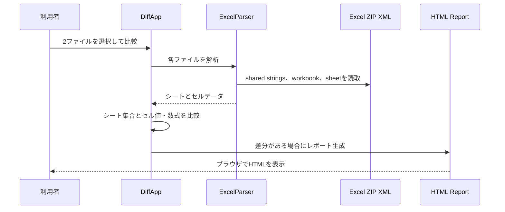

# Excel差分処理詳細

| 項目           | 内容                                        |
| :------------- | :------------------------------------------ |
| 管理ID         | IMPL-DD-001                                 |
| 対象モジュール | `prot/excel_diff.py`、`prot/html_report.py` |
| 入力           | `.xlsx` または `.xlsm` の2ファイル          |
| 出力           | GUI一覧、メッセージ、差分時のHTMLレポート   |

## 1. 処理契約

利用者は旧・新の2ファイルを選択する。未選択または同一の絶対パスは比較しない。共通シートが1件もない場合もエラーとして終了する。

## 2. 処理フロー

## 3. 解析・比較ルール

| 項目       | 現行動作                                                         |
| :--------- | :--------------------------------------------------------------- |
| 共有文字列 | `sharedStrings.xml` から通常文字列とリッチテキストを結合して取得 |
| シート対応 | `workbook.xml` と関係定義からシート名とXMLパスを対応付け         |
| セル表現   | セルアドレスごとに値と数式を取得                                 |
| 差分       | 値または数式のいずれかが異なるセルを差分とする                   |
| シート差分 | 片側のみのシートを追加または削除として表示                       |
| マクロ     | 両ファイルにある場合だけVBAバイナリのMD5不一致を警告             |

## 4. 失敗・制約

ZIP/XML解析の例外はメッセージボックスで通知する。スタイル、図表、関係定義、再計算結果、マクロ本体の詳細比較は行わない。片側だけに存在するマクロは警告対象外である。

## 5. HTML出力契約

差分がある場合だけ `output/` に時刻を含むHTMLファイルを作成する。シートの追加・削除、セル、旧新の値と数式をHTMLエスケープして記録し、既定ブラウザを起動する。

## 改訂履歴

| 版数    | 改訂日     | 変更者 | 変更内容・理由                    |
| :------ | :--------- | :----- | :-------------------------------- |
| Rev.1.0 | 2026-09-10 | xzyozi | Excel差分処理の実装済み動作を記録 |
