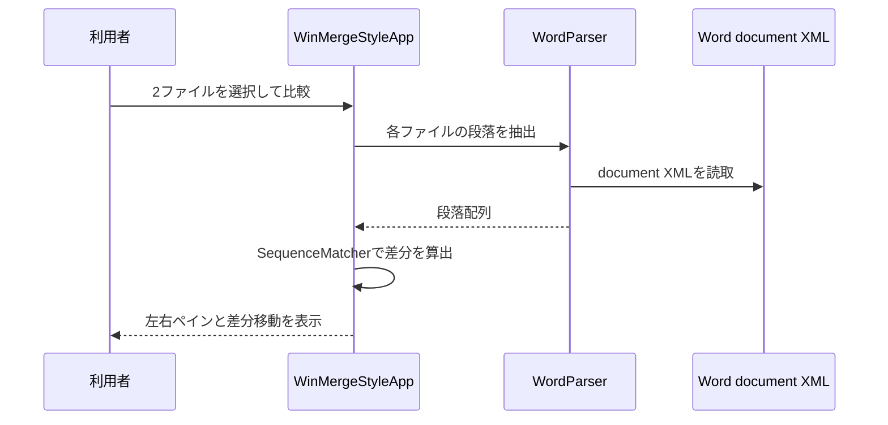

# Word差分処理詳細

| 項目           | 内容                                |
| :------------- | :---------------------------------- |
| 管理ID         | IMPL-DD-002                         |
| 対象モジュール | `prot/word_diff.py`                 |
| 入力           | `.docx` または `.docm` の2ファイル  |
| 出力           | 左右比較GUI、差分強調、差分ジャンプ |

## 1. 処理契約

旧・新の2ファイルを選択し、本文段落テキストを比較する。未選択または同一の絶対パスでは比較を中止する。無効なZIP、または `word/document.xml` がない入力は解析エラーとする。

## 2. 処理フロー

## 3. 段落抽出・表示ルール

| 項目           | 現行動作                                                                        |
| :------------- | :------------------------------------------------------------------------------ |
| 段落抽出       | `w:body` 直下の本文段落だけを対象に、テキスト要素を順番に連結して末尾空白を除去 |
| 目次除外       | 段落スタイルが `toc` で始まる、または「目次」を含む場合は除外                   |
| フィールド除外 | 複合フィールドの表示結果区間と `w:fldSimple` 配下を抽出対象から除外             |
| 比較単位       | 段落配列を `SequenceMatcher` へ渡す                                             |
| 整列           | 挿入・削除・置換で不足側に空行を置き、左右の行を同期                            |
| 表示           | 削除、追加、置換、空行を色分けし、前後または番号指定で循環移動                  |

## 4. 失敗・制約

書式、表、画像、ヘッダー・フッター、脚注、コメント、変更履歴は比較対象外である。比較結果はGUI表示のみで、HTML、JSON、差分履歴の出力は行わない。

## 改訂履歴

| 版数    | 改訂日     | 変更者 | 変更内容・理由                                 |
| :------ | :--------- | :----- | :--------------------------------------------- |
| Rev.1.0 | 2026-09-10 | xzyozi | Word差分処理の実装済み動作を記録               |
| Rev.1.1 | 2026-09-10 | xzyozi | 本文段落への対象限定と単純フィールド除外を反映 |
