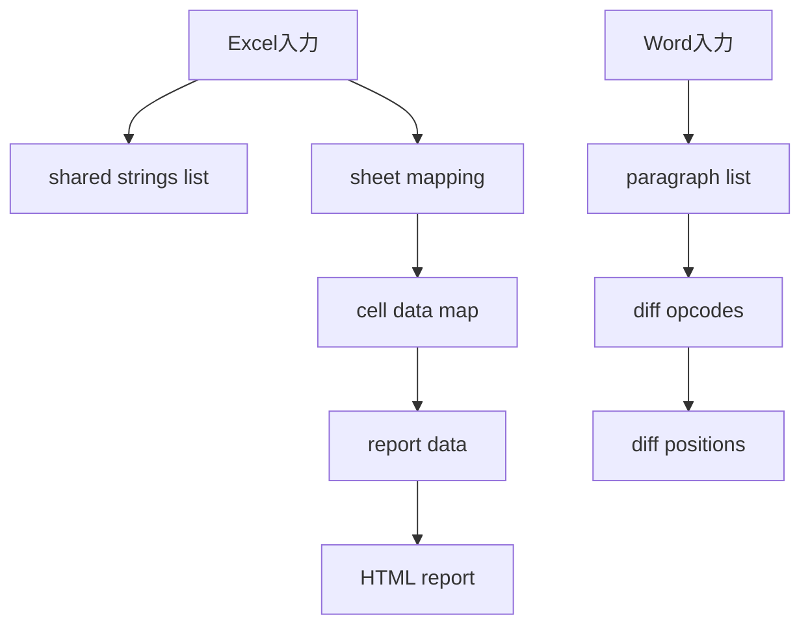

# 差分データ構造

| 項目         | 内容                          |
| :----------- | :---------------------------- |
| 管理ID       | IMPL-DS-001                   |
| 永続State    | なし                          |
| データ保持   | 比較処理中のメモリのみ        |
| ファイル出力 | Excel差分時のHTMLレポートのみ |

## 1. データ境界

現在の実装にはDTOクラス、dataclass、JSONスキーマ、データベース、設定ストア、ロック、原子的更新はない。本書は永続化仕様ではなく、暗黙の辞書・配列構造を将来の互換性確認のため記録する。

## 2. 構造概要

## 3. Excelのインメモリ表現

| 名称       | 型の概念                | 内容                             |
| :--------- | :---------------------- | :------------------------------- |
| 共有文字列 | `list[str]`             | shared stringsの文字列一覧       |
| シート対応 | `dict[str, str]`        | シート名からZIP内XMLパスへの対応 |
| セルデータ | `dict[str, dict]`       | セル番地ごとの `val` と `fml`    |
| シート差分 | `dict[str, list[dict]]` | シートごとのセル、旧新の値・数式 |
| シート集合 | `set[str]`              | 共通、追加、削除シートの判定用   |

## 4. Wordのインメモリ表現

| 名称     | 型の概念               | 内容                                 |
| :------- | :--------------------- | :----------------------------------- |
| 段落配列 | `list[str]`            | 抽出済み本文段落。空段落を含む       |
| opcode列 | SequenceMatcher結果    | equal、replace、delete、insertの区間 |
| 差分位置 | `list[int]`            | GUIの論理行番号。差分ジャンプに使用  |
| 表示タグ | `dict[str, list[int]]` | 左右ペインの色分け対象行             |

## 5. HTML成果物

Excel差分がある時だけ、`output/diff_report_YYYYMMDD_HHMMSS.html` を生成する。HTMLは一回の比較結果であり、再利用する正本データや実行履歴ではない。ファイル名、シート名、セル値、数式はHTMLエスケープして出力する。

## 改訂履歴

| 版数    | 改訂日     | 変更者 | 変更内容・理由                 |
| :------ | :--------- | :----- | :----------------------------- |
| Rev.1.0 | 2026-09-10 | xzyozi | 現行の差分表現と出力境界を記録 |
